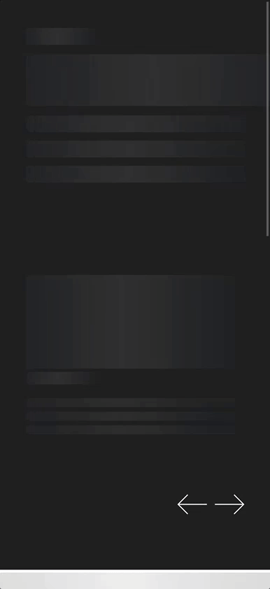
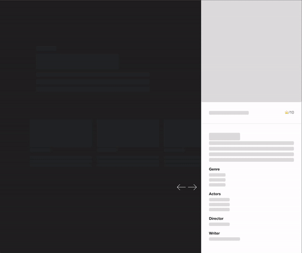

## OMDB Series application

## 🗂 Monorepo structure

| Package               | Description                                                |
| --------------------- | ---------------------------------------------------------- |
| [`web`](./apps/web)   | Front end application created with NextJS                  |
| [`ui`](./packages/ui) | React components with [stories](https://storybook.js.org/) |

## 💥 Features

- Mobile first
- Carousel with all episodes of the season made with `scroll-snap` css
- Dynamically loaded episodes
- Details about the episodes

## ⚒️ Stack

- Lerna with NPM monorepo
- NextJS
- React-query
- Cypress (E2E test)
- Testing Library (Unit test)
- React Loading Skeleton
- Vitest
- Storybook
- Github actions with Release
- Component library with React
- Conventional commits
- Semantic releases

## Demo





## ⚠️ Requirements

- Node >= `v18.12.1`
- NPM >= `8.19.2`

Create an `.env` file in [`web`](./apps/web):

```
NEXT_PUBLIC_OMBD_API_KEY=ENTER_YOUR_OMBD_API_KEY
```

## 🌐 Link

- Front end application: [Demo](https://omdb-series-web.vercel.app/)

## 🚀 Run locally

In the root folder run the following commands:

1. Install dependencies

```bash
  npm i
```

2. Run the project

```bash
  npm run dev
```

## 🚦 Testing

Unit tests: To run unit tests go to [`ui`](./packages/ui) and then run the following command:

```bash
## omdb-series/packages/ui
  npm run test
```

E2E tests: Go to [`web`](./apps/web) and then run the following command:

1. Running the project

```bash
  npm run dev
```

2. Start Cypress

```bash
  npx cypress open
```
